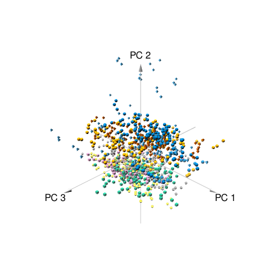

```{r setup, include=FALSE}
knitr::opts_chunk$set(echo = FALSE)
library("readxl")
library("dplyr")
library(lemon)
library(doBy)
library(ggplot2)
library(RVAideMemoire)
library(multcomp)
library(vegan)
library(car)
theme_set(theme_bw())
```


### Description

The data set was dowloaded from [here](https://archive.ics.uci.edu/ml/datasets/Mice+Protein+Expression). Let's explore our dataset.

```{r}
data_mice <- read_excel('C:/bioinformatics_institute/statistics_R_MachineLearning/Project_3\\Data_Cortex_Nuclear.xls')
``` 

```{r eval=FALSE, message=FALSE, warning=FALSE}
str(data_mice)
summary(data_mice) # contain information about number of NA in each column
```

It consists of the expression levels of 77 proteins/protein modifications that produced detectable signals in the nuclear fraction of cortex (columns 2-78) and columns with 'MouseID', 'Genotype' (control (c) or trisomy (t)), 'Treatment' (memantine (m) or saline (s)), 'Behavior' (context-shock (CS) or shock-context (SC)) and 'class'. The dataset contains a total of 1080 measurements per protein. Each measurement can be considered as an independent sample/mouse. 

Let's count total number of mice and its amount in each group. There are 38 control mice and 34 trisomic mice (Down syndrome), for a total of 72 mice. In the experiments, 15 measurements were registered of each protein per sample/mouse. Therefore, for control mice, there are 38x15, or 570 measurements, and for trisomic mice, there are 34x15, or 510 measurements.

```{r echo=FALSE, eval=FALSE, message=FALSE, warning=FALSE}
# is.null(data_mice[[1]]) # check the dataset for null values
# sum(is.na(data_mice[[1]])) # check the dataset for NA values
length(data_mice[[1]]) / 15 # total number of mice 72
# X <- split(data_mice, data_mice$Genotype) #list contains information about total number measurements for mice in each group

# or
length(which(data_mice$Genotype == 'Control')) #total number of measurements for control mice: 570 
length(which(data_mice$Genotype == 'Control'))/15 #number of control mice: 38
length(which(data_mice$Genotype == 'Ts65Dn')) #total number of measurements for trisomic mice: 510
length(which(data_mice$Genotype == 'Ts65Dn'))/15 #number of trisomic mice: 34
```

This data contains 1396 missing values (NA) and 87164 observations.

```{r eval=FALSE, message=FALSE, warning=FALSE}
summary(data_mice) # contain information about number of NA in each column
is.null(data_mice) # check if df contain null values
# sum(complete.cases(data_mice)) # number of rows without NA
# sum(!complete.cases(data_mice)) # number of rows with NA
x <- sapply(data_mice,function(x) sum(is.na (x))) # count NA in each column
sum(!is.na(data_mice)) # count number of non-missing values
```

```{r echo=TRUE, message=FALSE, warning=FALSE, out.width = "50%"}
table(is.na(data_mice))

```

The eight classes of mice are described based on features such as genotype, behavior and treatment. According to genotype, mice can be control or trisomic. According to behavior, some mice have been stimulated to learn (context-shock, CS) and others have not (shock-context, SC) and in order to assess the effect of the drug memantine in recovering the ability to learn in trisomic mice, some mice have been injected with the drug and others have not. Thus, for the two genotypes, control and trisomic, there are a total of 8 groups of mice. 

```{r echo=FALSE, message=FALSE, warning=FALSE}
unique(data_mice[[82]])

```
Let's count number of observations in each group. 

```{r render=lemon_print, message=FALSE, warning=FALSE}
table(data_mice$class)
```

We see unbalanced design of the experiment. Not all groups have an equal number of observations.

In addition data can be sorted on a variable 'Treatment'

```{r message=FALSE, warning=FALSE}
table(data_mice$Genotype)
```

'Genotype' 

```{r message=FALSE, warning=FALSE}
table(data_mice$Treatment)
```

and 'Behavior'. 

```{r message=FALSE, warning=FALSE}
table(data_mice$Behavior)
```

These groups are also unbalanced.

### Dependence between a level of BDNF gene expression and variable "class" in the experiment

#### EDA

We will start with short EDA. Let's find and delete NA from data and count number of observations in each group.

```{r message=FALSE, warning=FALSE}
df_BDNF_N <- data_mice[,c(4,79,82)]
df_BDNF_N_wo_NA <- na.omit(df_BDNF_N)
df_BDNF_N_wo_NA$class <- factor(df_BDNF_N_wo_NA$class)
table(df_BDNF_N_wo_NA$class)
```
As we can see variable 'class' sorts data into eight unbalanced groups.
The main statistics:

```{r message=FALSE, warning=FALSE}
summaryBy(BDNF_N ~ class + source, data = df_BDNF_N_wo_NA,
          FUN = c(mean, sd, length))
```

To better understand the properties of the existing data, we visualize it using a one-dimensional scatter plot:

```{r fig.align = 'center', out.width = "70%", message=FALSE, warning=FALSE}
attach(df_BDNF_N_wo_NA)
stripchart(BDNF_N ~ class, xlab = "BDNF level", ylab = "class")
```

and boxplot:

```{r fig.align = 'center', out.width = "70%", message=FALSE, warning=FALSE}
ggplot(data = df_BDNF_N_wo_NA, aes(x = class, y = BDNF_N)) + 
  geom_boxplot(aes(fill = Genotype))
```

Data contain outliers which can be deleted. Let's check our data after deletion of outliers.

```{r echo = FALSE, fig.align = 'center', out.width = "70%", message=FALSE, warning=FALSE}
## Function which delete outliers

remove_outliers <- function(x, na.rm = TRUE, ...) {
  qnt <- quantile(x, probs = c(.25, .75), na.rm = na.rm, ...)
  val <- 1.5 * IQR(x, na.rm = na.rm)
  y <- x
  y[x < (qnt[1] - val)] <- NA
  y[x > (qnt[2] + val)] <- NA
  y
}

## Deletion of outliers

library(dplyr)

df_BDNF_wo_outliers <- df_BDNF_N_wo_NA %>%  group_by(class) %>% 
  mutate(BDNF_N = remove_outliers(BDNF_N)) %>% 
  ungroup() %>% 
  filter(!is.na(BDNF_N))

ggplot(data = df_BDNF_wo_outliers, aes(x = class, y = BDNF_N)) + 
  geom_boxplot(aes(fill = Genotype))
```

We calculate the group averages:

```{r message=FALSE, warning=FALSE}
attach(df_BDNF_wo_outliers)
tapply(BDNF_N, class, mean)
```

and number of observations in each group after removing of outliers:

```{r message=FALSE, warning=FALSE}
table(df_BDNF_wo_outliers$class)
```

As we can see after removing outliers our groups are also unbalanced.

#### One-way Anova

We can conduct one-way Anova analysis to compare means in all groups. Function "aov" provides a wrapper to lm for fitting linear models to balanced or unbalanced experimental designs (as in our case).

```{r message=FALSE, warning=FALSE}
BDNF_aov <- aov(BDNF_N ~ class, data = df_BDNF_wo_outliers)
BDNF_anova <- anova(BDNF_aov)
BDNF_anova
```

Test shows that the level of BDNF_N gene production differs depending on the class type: F-statistic: `r BDNF_anova[1,4]`, p-value = `r BDNF_anova[1,5]`, df1 = `r BDNF_anova[1,1]`, df2 = `r BDNF_anova[2,1]`.

#### Assumptions for One-Way ANOVA Test

There are several requirements to perform a one-way Anova:  
  
- Normal Distribution    
- Variance Equality    
- Sample independence  
  
Let's check the first two assumptions required for analysis of variance (ANOVA).  
  
**I Test for a normal distribution**
  
The normality condition for analysis of variance assumes that the values of the dependent variable have a normal distribution within each group, determined by the levels of the studied factor.  
  
**_Visual assessment of normal distribution_**

```{r message=FALSE, warning=FALSE, fig.align = 'center', out.width = "70%"}
ggplot(df_BDNF_wo_outliers, aes(x = BDNF_N)) +
  geom_histogram(fill = "white", colour = "black", bins = 30) +
  facet_grid(class ~ .)

```
  
**_Shapiro-test for each group_**

```{r message=FALSE, warning=FALSE}
byf.shapiro(BDNF_N ~ class,data=df_BDNF_wo_outliers)
```

All tests show some deviation from a normal distribution for three groups (p value < 0.05). This conclusion is consistent with a visual assessment of the distribution. Thus, the normality condition for the obtaindes model is not satisfied.

**II Test for homogeneity of variance across groups**

The second important condition for the applicability of the classical analysis of variance is the homogeneity (or "homoscedasticity") of group variances.
  
**_Graphical visualisation with box-whisker plots:_**  
  
```{r fig.align = 'center', out.width = "70%", message=FALSE, warning=FALSE}
boxplot(BDNF_N ~ class, data = df_BDNF_wo_outliers, xlab = 'BDNF level', ylab = 'class', main = 'Dependence between BDNF production and class', col = "orange", border="brown", horizontal = TRUE, notch = TRUE)
```

  
**_Levene's test_**  

```{r message=FALSE, warning=FALSE}
library(car)
leveneTest(df_BDNF_wo_outliers$BDNF_N, df_BDNF_wo_outliers$class)
```
Results of Levene's test indicate the homogeneity of the group variances assumption has been not satisfied.  
  
Thus conventional one-way Anova is not an appropriate method for these data (both assumption is not satisfied). We can try to transform our data to improve our model.

```{r message=FALSE, warning=FALSE}
BDNF_lm_log <- lm(log(BDNF_N + 1) ~ class, data = df_BDNF_wo_outliers)
summary(BDNF_lm_log)
```

The F-statistic calculated with the new model is different from the original (19.77 instead of 20). Unfortunately the logarithm of the initial data doesn't led to the fulfillment of Variance Equality condition for the applicability of one-way ANOVA.  
  
**_Shapiro-Wilk normality test_**

```{r message=FALSE, warning=FALSE}
shapiro.test(resid(BDNF_lm_log))
```
**_Levene's test_**  
  
```{r message=FALSE, warning=FALSE}
leveneTest(log(df_BDNF_wo_outliers$BDNF_N + 1), df_BDNF_wo_outliers$class)
```
  
  
#### Kruskal-Wallis rank sum test

Previously our attempt to use one-way Anova analysis is failed. In this case it can be possible to use _Kruskal-Wallis rank sum test_.  

```{r message=FALSE, warning=FALSE}
kruskal.test(BDNF_N ~ class, data = df_BDNF_wo_outliers)
```

The result of Kruskal-Wallis rank sum test indicates that the null hypothesis about no group differences can be rejected.  
Thus we can say about a statistically significant difference between groups.  
  
#### Post-hoc tests
  
ANOVA only tells us about factor affects. However it does not say which groups are different. To find out, you need to do post-hoc tests.

```{r message=FALSE, warning=FALSE}
post_hoch <- glht(BDNF_aov, linfct = mcp(class = "Tukey"))
result<-summary(post_hoch)
result
```
In total, we see that 28 pairwise comparisons were made. 14 couples found significant differences:  
   
c-SC-m - c-CS-m   
c-SC-s - c-CS-m    
t-CS-m - c-CS-m    
t-CS-s - c-CS-m    
t-SC-m - c-CS-m     
c-SC-m - c-CS-s    
c-SC-s - c-CS-s      
t-CS-m - c-CS-s    
t-CS-s - c-CS-s     
t-SC-m - c-CS-s     
c-SC-s - c-SC-m    
t-CS-m - c-SC-m    
t-SC-m - c-SC-m    
t-SC-s - c-SC-m    
  
These results demonstrate that the most groups have significant differences.  
  
### PCA  
  
At first we will delete column with max number of missing values.
  
```{r message=FALSE, warning=FALSE}
summary(data_mice[,c(70,71,73,75:77)])

```
```{r echo=FALSE, message=FALSE, warning=FALSE}
data_for_pca <- data_mice[,-c(1,70,71,73,75:77,79:81)]
data_for_pca_wo_NA <- na.omit(data_for_pca)
data_pca <-  rda(data_for_pca_wo_NA[,-72], scale = TRUE)
pca_prcomp <- prcomp(data_for_pca_wo_NA[,-72], scale = TRUE)
```

Let's see the result of PCA. We see PC1 explained ~ 28% of general variability, PC2 ~ 16%, PC3 ~ 11% and etc (see Proportion Explained).  

```{r message=FALSE, warning=FALSE}
c <- summary(data_pca)
c$cont
```

**_Visualisation of proportion explained_**

```{r fig.align = 'center', out.width = "70%", message=FALSE, warning=FALSE}
plot(pca_prcomp, main = 'Proportion of dispersion explained by each component')

```
**_Graph Eigenvalue_**  
  
```{r fig.align = 'center', out.width = "70%", message=FALSE, warning=FALSE}
screeplot(data_pca, type = "lines", bstick = TRUE, main = 'Graph Eigenvalue') # eigenvalue graph
```
We see that 6 PC explain the most proportion of dispersion.


#### Correlation biplot (loading plot)
  
The angles between the vectors reflect the correlations of features with each other and with the axes of the principal components.  

```{r fig.align = 'center', out.width = "70%", message=FALSE, warning=FALSE}
biplot(data_pca, scaling = "species", display = "species")
```

#### Distance biplot (ordination plot)
  
Distances between points approximate Euclidean distances and reflect the similarity between objects.  

```{r fig.align = 'center', out.width = "70%", message=FALSE, warning=FALSE}
biplot(data_pca, scaling = "sites", display = "sites")
```


```{r fig.align = 'center', out.width = "70%", message=FALSE, warning=FALSE}
df_scores <- data.frame(data_for_pca_wo_NA,
                        scores(data_pca, display = "sites", choices = c(1, 2, 3), scaling = "sites"))

p_scores <- ggplot(df_scores, aes(x = PC1, y = PC2)) + 
  geom_point(aes( color = class), alpha = 0.5) +
  coord_equal(xlim = c(-1.2, 1.2), ylim = c(-1.2, 1.2)) + ggtitle(label = "PCA ordination diagram") + theme_bw()
p_scores
```
```{r echo=FALSE, eval=FALSE, fig.align = 'center', out.width = "50%", message=FALSE, warning=FALSE}
library(pca3d)
gr <- factor(data_for_pca_wo_NA$class)
pca3d(pca_prcomp, group = gr)
#snapshotPCA3d(file="3d_pca.png")

```
**_3D plot for the first 3 components_**
```{r pressure, echo=FALSE, message=FALSE, warning=FALSE, fig.align = 'center', out.width = '50%'}


```


### Prediction of ERBB4_N level production with linear model

Let's create full linear model with all predictors and see summary of this model.  

```{r echo=FALSE, message=FALSE, warning=FALSE}

data_for_lm <- data_for_pca_wo_NA[,-72]
mod_1 <- lm(ERBB4_N ~ ., data_for_lm)
summary(mod_1)
```
This model contains 26 statistical significant predictors. These predictors we will take away to build our model. Then check model for multicollinearity with **VIF** (variance inflation factor). Let's see result of VIF function in model which does not have multicollinearity.  
  


```{r echo=FALSE, message=FALSE, warning=FALSE}
data_sign_predictors <- data_for_lm[,c(2,4,6,9,13,21, 23, 25, 30, 34, 36, 46, 47, 51, 52, 54, 55, 57:59, 61:64, 67, 70,71)]
mod_2 <- lm(ERBB4_N ~ ., data_sign_predictors)

# vif(mod_2)
mod_3 <- update(mod_2, .~. - ITSN1_N) # delete predictor ITSN1_N

# vif(mod_3)
mod_4 <- update(mod_3, .~. - ERK_N) # delete predictor ERK_N

# vif(mod_4)
mod_5 <- update(mod_4, .~. - PKCA_N) # delete predictor PKCA_N

# vif(mod_5)
mod_6 <- update(mod_5, .~. - pMTOR_N ) # delete predictor pMTOR_N

# vif(mod_6)
mod_7 <- update(mod_6, .~. - RSK_N) # delete predictor RSK_N

# vif(mod_7)
mod_8 <- update(mod_7, .~. - AcetylH3K9_N) # delete predictor AcetylH3K9_N

# vif(mod_8)
mod_9 <- update(mod_8, .~. - IL1B_N) # delete predictor IL1B_N
 
# vif(mod_9)
mod_10 <- update(mod_9, .~. - CaNA_N) # delete predictor CaNA_N

# vif(mod_10)
mod_11 <- update(mod_10, .~. - pAKT_N) # delete predictor pAKT_N

# vif(mod_11)
mod_12 <- update(mod_11, .~. - PSD95_N) #delete predictor PSD95_N

# vif(mod_12)
mod_13 <- update(mod_12, .~. - pCREB_N) #delete predictor pCREB_N

# vif(mod_13)
mod_14 <- update(mod_13, .~. - ARC_N) #delete predictor ARC_N

# vif(mod_14)
mod_15 <- update(mod_14, .~. - GFAP_N) #delete predictor GFAP_N

# vif(mod_15)
mod_16 <- update(mod_15, .~. - pGSK3B_Tyr216_N) #delete predictor pGSK3B_Tyr216_N

# vif(mod_16)
mod_17 <- update(mod_16, .~. - SYP_N) #delete predictor SYP_N

# vif(mod_17)
mod_18 <- update(mod_17, .~. - MTOR_N) #delete predictor MTOR_N

vif(mod_18)

```
  
And summary of final model:  
  


```{r echo=FALSE, message=FALSE, warning=FALSE}
final_model <- lm(ERBB4_N ~ NR1_N + BRAF_N + CREB_N + pGSK3B_N + pPKCG_N + RRP1_N + Tau_N + 
                    GluR3_N + P3525_N + pCASP9_N, data = data_for_lm)
summary(final_model)
```
  
  
**Final model: ERBB4_N = 0.0511372 + 0.0070194 * NR1_N - 0.0098976 * BRAF_N + 0.0935285 * CREB_N - 0.0377544 * pGSK3B_N - 0.0063809 * pPKCG_N -0.0593441 * RRP1_N + 0.0718677 * Tau_N - 0.0278340 * GluR3_N + 0.1829900 * P3525_N + 0.0261596 * pCASP9_N**  
  


#### Model Diagnostics

Let's plot graph of residuals and Cook's distance plot. These graphs show that final model isn't ideal. There are a lot of observations outside of 2SD on the graph of residuals. In addition a lot of observations deviate from line on the Cook's plot.  
  

```{r echo=FALSE, fig.align = 'center', out.width = "50%", message=FALSE, warning=FALSE}
mod_diag <- data.frame(fortify(mod_18), data_for_lm[, c(4, 21, 23, 46, 47, 52, 55, 57, 59, 62, 63)])

gg_resid <- ggplot(data = mod_diag, aes(x = .fitted, y = .stdresid)) + 
  geom_point() + 
  geom_hline(yintercept = 0) +
  geom_smooth(method = "lm") +
  geom_hline(yintercept = 2, color = "red") +
  geom_hline(yintercept = -2, color = "red")
gg_resid

ggplot(mod_diag, aes(x = 1:nrow(mod_diag), y = .cooksd)) + 
  geom_bar(stat = "identity") + 
  geom_hline(yintercept = 2, color = "red")

```

```{r echo=FALSE, fig.align = 'center', out.width = "50%", message=FALSE, warning=FALSE}
qqPlot(mod_diag$.stdresid)
```


We see that attempt to create adequate model which can explain our data with a lot of number of variables is difficult.Linear models are not the best choice due to the high collinearity of the predictors.  
Performing backwards elimination of variables, similar to how we did in this exercise, only helps us simplify our model for computation purposes and, potentially, improve performance as measured by metrics such as the sum of squares of residuals. A variable that is eliminated from the model does not suggest the variable is not significant in real life [c](https://towardsdatascience.com/problems-with-multiple-linear-regression-in-r-bef5940518b).


